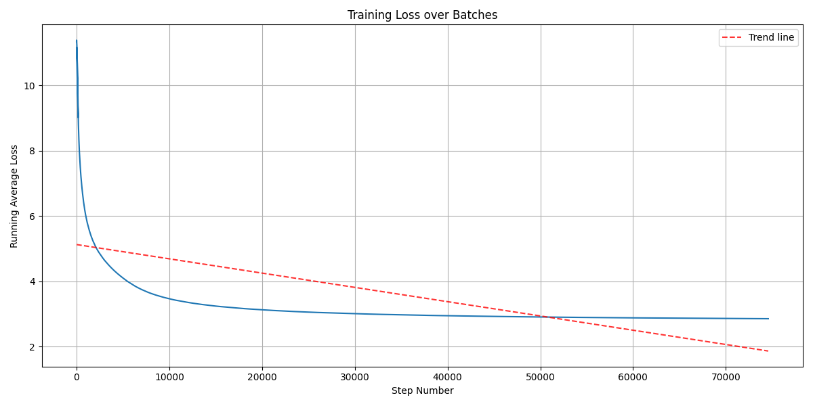
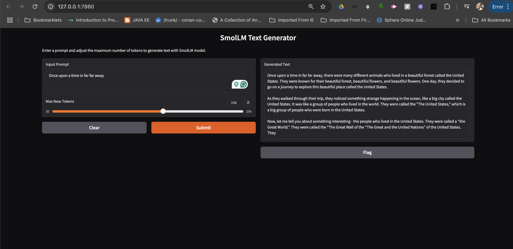

# SmolLm2 - 135M From Scratch

- In this project, we will be training a [SmolLM2-135M](https://huggingface.co/HuggingFaceTB/SmolLM2-135M)  parameter model from scratch. 
- We will demonstrate How Training is improving text generation quality as training progresses.

---
## Dataset Information
- We will train on [Cosmopedia-2](https://huggingface.co/datasets/HuggingFaceTB/smollm-corpus) dataset.
These models are built on a meticulously curated high-quality training corpus, which are releasing as SmolLM-Corpus. [Smollm Corpus  ](https://huggingface.co/blog/smollm) includes:
1. Cosmopedia v2: A collection of synthetic textbooks and stories generated by Mixtral (28B tokens)
2. Python-Edu: educational Python samples from The Stack (4B tokens)
3. FineWeb-Edu (deduplicated): educational web samples from FineWeb (220B tokens)

- scope of this project is to train a model from scratch and generate text, Training over 250B tokens is not possible for my budget.

## Training Configuration
- Batch Size: 16
- Sequence Length: 1024
- Gradient Accumulation: 2
- Effective Batch Size: 32
- Training Steps: 74002 ( 37000 actual steps because of gradient accumulation)
- Number of GPUs: 1
- Number of Tokens Seen: 1_212_465_152

## AWS EC2 Instance: 
- g5.2xlarge - 8 vCPUs, 32 GB RAM, 1 24 GB GPU Memory (A10G Tensor Core GPUs)
- Spot Instance price : $0.3377 per hour
- Total Cost: $0.3377 * 14  = $4.7278

## Model Architecture of SmolLM2-135M
- HuggingFace SmolLM2-135 M is based on Llama 3 architecture.
```bash
params : 135M
hidden_size = 576
num_attention_heads = 9
num_key_value_heads = 3
head_dim = 1536
embed_dim = 576
Vocab Size = 49152
LR = 3e-5

```
1. HuggingFace SmolLM2-135 M

```
LlamaForCausalLM(
  (model): LlamaModel(
    (embed_tokens): Embedding(49152, 576)
    (layers): ModuleList(
      (0-29): 30 x LlamaDecoderLayer(
        (self_attn): LlamaAttention(
          (q_proj): Linear(in_features=576, out_features=576, bias=False)
          (k_proj): Linear(in_features=576, out_features=192, bias=False)
          (v_proj): Linear(in_features=576, out_features=192, bias=False)
          (o_proj): Linear(in_features=576, out_features=576, bias=False)
        )
        (mlp): LlamaMLP(
          (gate_proj): Linear(in_features=576, out_features=1536, bias=False)
          (up_proj): Linear(in_features=576, out_features=1536, bias=False)
          (down_proj): Linear(in_features=1536, out_features=576, bias=False)
          (act_fn): SiLU()
        )
        (input_layernorm): LlamaRMSNorm((576,), eps=1e-05)
        (post_attention_layernorm): LlamaRMSNorm((576,), eps=1e-05)
      )
    )
    (norm): LlamaRMSNorm((576,), eps=1e-05)
    (rotary_emb): LlamaRotaryEmbedding()
  )
  (lm_head): Linear(in_features=576, out_features=49152, bias=False)
)
```

---

## Custom Implementation SmolLM3

```
LlamaModel(
  (embed_tokens): Embedding(49152, 576)
  (rotary_emb): RotaryPositionalEmbedding()
  (layers): ModuleList(
    (0-29): 30 x LlamaDecoderLayer(
      (self_attn): LlamaAttention(
        (q_proj): Linear(in_features=576, out_features=576, bias=False)
        (k_proj): Linear(in_features=576, out_features=192, bias=False)
        (v_proj): Linear(in_features=576, out_features=192, bias=False)
        (o_proj): Linear(in_features=576, out_features=576, bias=False)
        (rotary_pos_emb): RotaryPositionalEmbedding()
      )
      (mlp): LlamaMLP(
        (gate_proj): Linear(in_features=576, out_features=1536, bias=False)
        (up_proj): Linear(in_features=576, out_features=1536, bias=False)
        (down_proj): Linear(in_features=1536, out_features=576, bias=False)
        (act_fn): SiLU()
      )
      (input_layernorm): LlamaRMSNorm()
      (post_attention_layernorm): LlamaRMSNorm()
    )
  )
  (norm): LlamaRMSNorm()
  (lm_head): Linear(in_features=576, out_features=49152, bias=False)
)
```

```python
import torch
import torch.nn as nn
import torch.nn.functional as F
from torch.nn import SiLU
import yaml


def _init_weights(module, std=0.041666666666666664):
    if isinstance(module, nn.Linear):
        module.weight.data.normal_(mean=0.0, std=std)
    elif isinstance(module, nn.Embedding):
        module.weight.data.normal_(mean=0.0, std=std)

class RotaryPositionalEmbedding(nn.Module):
    """
    # https://github.com/huggingface/transformers/blob/main/src/transformers/models/llama/modeling_llama.py#L240
    Rotary Positional Embedding (RoPE) for transformers Implemntation derived from https://github.com/huggingface/transformers/blob/main/src/transformers/models/llama/modeling_llama.py
    """
    def __init__(self, dim: int, theta: float = 10000.0):
        super().__init__()
        self.dim = dim
        self.theta = theta

    def forward(self, x: torch.Tensor, seq_len: int) -> torch.Tensor:
        """
        Apply rotary positional embedding to the input tensor.

        Args:
            x (torch.Tensor): Input tensor of shape # B, T, H, D
            seq_len (int): Sequence length. #T

        Returns:
            torch.Tensor: Output tensor with rotary positional embeddings applied.
        """
        B, T, H, H_D = x.shape

        # Generate position indices
        position = torch.arange(T, dtype=torch.float32, device=x.device).unsqueeze(-1)

        # Generate frequencies
        freqs = torch.exp(
            torch.arange(0, H_D, 2, dtype=torch.float32, device=x.device) * 
            -(torch.log(torch.tensor(self.theta)) / H_D)
                                                                
        )

        # Compute sinusoids
        sinusoid = position * freqs
        sin = torch.sin(sinusoid)
        cos = torch.cos(sinusoid)

        # Reshape sin and cos to match the input tensor's shape
        sin = sin.unsqueeze(0).unsqueeze(2)  # Shape: (1, T, 1, D // 2)
        cos = cos.unsqueeze(0).unsqueeze(2)  # Shape: (1, T, 1, D // 2)

        # Apply rotary embeddings
        x_rotated = x.clone()
        x_rotated[..., 0::2] = x[..., 0::2] * cos - x[..., 1::2] * sin
        x_rotated[..., 1::2] = x[..., 1::2] * cos + x[..., 0::2] * sin

        return x_rotated
    
class LlamaAttention(nn.Module):
    """
    (self_attn): LlamaAttention(
          (q_proj): Linear(in_features=576, out_features=576, bias=False)
          (k_proj): Linear(in_features=576, out_features=192, bias=False)
          (v_proj): Linear(in_features=576, out_features=192, bias=False)
          (o_proj): Linear(in_features=576, out_features=576, bias=False)
    )
    """
    def __init__(self, config, rotary_emb):
        super().__init__()
        self.config = config
        self.num_attention_heads = self.config['num_attention_heads']
        self.hidden_size = self.config['hidden_size']
        # Ensure the hidden size is divisible by the number of attention heads
        if self.hidden_size % self.num_attention_heads != 0:
            raise ValueError(
                f"hidden_size ({self.hidden_size}) must be divisible by num_attention_heads ({self.num_attention_heads})"
            )
        self.num_key_value_heads = self.config['num_key_value_heads']
        self.head_dim =  self.hidden_size // self.num_attention_heads
        self.q_proj = nn.Linear(self.hidden_size, self.hidden_size, bias=False)  # D,D
        self.k_proj = nn.Linear(self.hidden_size, self.head_dim*self.num_key_value_heads, bias=False)   # D,D/H
        self.v_proj = nn.Linear(self.hidden_size, self.head_dim*self.num_key_value_heads, bias=False)   # D,D/H
        self.o_proj = nn.Linear(self.hidden_size, self.hidden_size, bias=False)   # D,D

        # Convert the mask to boolean type when creating it
        # self.register_buffer("mask", 
        #                    torch.triu(torch.ones(self.config['max_position_embeddings'], 
        #                                        self.config['max_position_embeddings']),
        #                             diagonal=1))  # Convert to boolean
        
        self.rotary_pos_emb = rotary_emb

    def forward(self, x):
        B, T, C = x.size()

        q = self.q_proj(x)  # B,T,D
        k = self.k_proj(x)  # B,T,D/H
        v = self.v_proj(x)  # B,T,D/H

        q = q.view(B, T, self.num_attention_heads, self.head_dim) # B,T,H,D
        k = k.view(B, T, self.num_key_value_heads, self.head_dim) # B,T,H,D
        v = v.view(B, T, self.num_key_value_heads, self.head_dim) # B,T,H,D

        q = q.transpose(1,2) # B,H,T,D
        k = k.transpose(1,2) # B,num_key_value_heads,T,D
        v = v.transpose(1,2) # B,num_key_value_heads,T,D

        # apply rotary positional embedding
        q = self.rotary_pos_emb(q, T)
        k = self.rotary_pos_emb(k, T)

        # Repeat k/v heads if num_key_value_heads < num_attention_heads
        if self.num_key_value_heads != self.num_attention_heads:
            k = k.repeat_interleave(self.num_attention_heads // self.num_key_value_heads, dim=1) # B,kv_head,T,D -> B,H,T,D
            v = v.repeat_interleave(self.num_attention_heads // self.num_key_value_heads, dim=1) # B,kv_head,T,D -> B,H,T,D

        # Manual attention Stats
        # Q(B,H,T,D) @K.T(B,H,D,T) = Q.K_T (B,H,T,T)
        # attn_scores = q @ k.transpose(-2,-1) # B,H,T,T
        # mask_bool = self.mask[:T,:T].bool() # T,T
        # attn_scores.masked_fill_(mask_bool, -torch.inf) # B,H,T,T
        # attn_weights = F.softmax(attn_scores/k.size(-1)**0.5, dim=-1) # B,H,T,T
        # context_vector = attn_weights @ v # B,H,T,T * B,H,T,D = B,H,T,D
        # context_vector = context_vector.transpose(1,2) # B,T,H,D
        # context_vector = context_vector.contiguous().view(B,T,C) # B,T,H,D -> B,T,D
        # Manual attention Stats ENDS

        # Scaled dot-product attention STARTS   
        attn_out = F.scaled_dot_product_attention(q, k, v, is_causal=True)
        context_vector = attn_out.transpose(1,2).reshape(B,T,C)
        # Scaled dot-product attention ENDS

        context_vector = self.o_proj(context_vector)
        
        return context_vector


class LlamaMLP(nn.Module):
    """
    (mlp): LlamaMLP(
          (gate_proj): Linear(in_features=576, out_features=1536, bias=False)
          (up_proj): Linear(in_features=576, out_features=1536, bias=False)
          (down_proj): Linear(in_features=1536, out_features=576, bias=False)
          (act_fn): SiLU()
        )
    """
    def __init__(self, config):
        super().__init__()
        self.config = config
        self.gate_proj = nn.Linear(self.config['hidden_size'], self.config['intermediate_size'], bias=False)
        self.up_proj = nn.Linear(self.config['hidden_size'], self.config['intermediate_size'], bias=False)
        self.down_proj = nn.Linear(self.config['intermediate_size'], self.config['hidden_size'], bias=False)
        self.act_fn = SiLU()
    def forward(self, x):
        gate = self.gate_proj(x)
        up = self.up_proj(x)
        down = self.down_proj(self.act_fn(gate)*up)
        return down 
    
class LlamaRMSNorm(nn.Module):
    """
    (norm): LlamaRMSNorm((576,), eps=1e-05)
        # RMSNorm Formula:
        #    RMS(x) = sqrt((1 / d) * sum(x_i^2 for i in range(d)))
        #    x_normalized = x / RMS(x)
        #    output = gamma * x_normalized
    
    """
    def __init__(self, config):
        super().__init__()
        self.config = config
        self.eps = self.config['rms_norm_eps']
        self.weight = nn.Parameter(torch.ones(self.config['hidden_size']))
    def forward(self, x):
        rms = torch.rsqrt(torch.mean(x ** 2, dim=-1, keepdim=True) + self.eps)
        return  self.weight *rms * x
    
class LlamaDecoderLayer(nn.Module):
    def __init__(self, config, rotary_emb):
        super().__init__()
        self.config = config
        self.self_attn = LlamaAttention(self.config, rotary_emb)
        self.mlp = LlamaMLP(self.config)
        self.input_layernorm = LlamaRMSNorm(self.config)
        self.post_attention_layernorm = LlamaRMSNorm(self.config)   
    
    def forward(self, x):
        residual = x
        x = self.input_layernorm(x)
        x = self.self_attn(x)
        x = x + residual

        residual = x
        x = self.post_attention_layernorm(x)
        x = self.mlp(x)
        x = x + residual
        return x 
    
class LlamaModel(nn.Module):
    def __init__(self, config):
        super().__init__()
        self.init_method = config['init_method']
        self.config = config['model_config']
        self.embed_tokens = nn.Embedding(self.config['vocab_size'], self.config['hidden_size'])
        self.rotary_emb = RotaryPositionalEmbedding(self.config['hidden_size'], self.config['rope_theta'])
        self.layers = nn.ModuleList([LlamaDecoderLayer(self.config, self.rotary_emb) for _ in range(self.config['num_hidden_layers'])])
        self.norm = LlamaRMSNorm(self.config)
        self.lm_head = nn.Linear(self.config['hidden_size'], self.config['vocab_size'], bias=False)
        
        if self.config['tie_word_embeddings']:
            self.lm_head.weight = self.embed_tokens.weight
        
        self.apply(lambda m: _init_weights(m, self.init_method['std']))
    
    def forward(self, x, y=None):
        x = self.embed_tokens(x)
        for layer in self.layers:
            x = layer(x)
        x = self.norm(x)
        logits = self.lm_head(x) # B,T,V
        logits = logits.view(-1, logits.size(-1))  # Shape: [B*T, V]
        if y is not None:
            y = y.view(-1)  # Shape: [B*T]
            loss = torch.nn.functional.cross_entropy(logits, y)
            return logits, loss
        else:
            return logits, None

    
```

## Validation
```python
from transformers import AutoTokenizer, AutoModelForCausalLM
from SmolLm3 import LlamaModel
import yaml
config = yaml.load(open('config_smollm2_135M.yaml', "r"), Loader=yaml.FullLoader)
tokenizer = AutoTokenizer.from_pretrained("HuggingFaceTB/SmolLM2-135M")
model = AutoModelForCausalLM.from_pretrained("HuggingFaceTB/SmolLM2-135M")
hf_model_params = sum(p.numel() for p in model.parameters())
custom_model = LlamaModel(config['model'])
custom_model_params = sum(p.numel() for p in custom_model.parameters())
print(f"HF Model Params: {hf_model_params}, Custom Model Params: {custom_model_params}")
assert hf_model_params == custom_model_params, "Custom model parameters do not match the expected number of parameters in HuggingFace model"
print("Custom model parameters match the expected number of parameters in HuggingFace model")

# HF Model Params: 134515008, Custom Model Params: 134515008
#Custom model parameters match the expected number of parameters in HuggingFace model
```

---
### Training Loss Plot


---
## Inference
- we will see how the model generates text, as we training the model more and more. we will generate text from model saved at different checkpoints for same input prompt and see how the text generation quality is improving.

```python
import argparse
from SmolLm3 import LlamaModel
import yaml
import torch
from transformers import AutoTokenizer


def generate_helper(model, idx, max_new_tokens, context_length, temperature=1.0, top_k=None, eos_token=None, device=None):
    
    model = model.to(device)
    idx = idx.to(device)
    model.eval()
    for _ in range(max_new_tokens):
        idx_cond = idx[:, -context_length:]
        with torch.no_grad():
            logits, _ = model(idx_cond)  # Unpack both logits and loss (ignore loss)
            logits = logits.view(idx_cond.shape[0], -1, model.config['vocab_size'])  # Reshape to [batch, seq, vocab]
            
        # Get the logits for the last token only
        logits = logits[:, -1, :]  # Shape: [batch_size, vocab_size]
        
        if top_k is not None:
            # top k sampling
            top_logits, top_pos = torch.topk(logits, top_k)
            min_logit = top_logits[:, -1].unsqueeze(-1)
            logits = torch.where(logits < min_logit,
                               torch.tensor(float('-inf')).to(logits.device),
                               logits)
        
        # temperature scaling
        if temperature > 0.0:
            logits /= temperature
            probs = torch.softmax(logits, dim=-1)
            idx_next = torch.multinomial(probs, num_samples=1)
        else:
            idx_next = torch.argmax(logits, dim=-1, keepdim=True)
            
        if idx_next.item() == eos_token:
            break
            
        idx = torch.cat((idx, idx_next), dim=1)
    model.train()
    return idx


def get_config(config_path):
    config = yaml.load(open(config_path, "r"), Loader=yaml.FullLoader)
    return config

def load_weights(config, weights_path, device):
    model = LlamaModel(config['model'])
    model.load_state_dict(torch.load(weights_path, map_location=torch.device(device)))
    return model

def load_model_from_checkpoint(config_path, checkpoint_path, device):
    config = get_config(config_path)
    model = LlamaModel(config['model'])
    checkpoint = torch.load(checkpoint_path, map_location=torch.device(device))
    state_dict = checkpoint['model_state_dict']
    state_dict = {k.replace('_orig_mod.', ''): v for k, v in state_dict.items()}
    model.load_state_dict(state_dict)
    return model

def get_tokenizer(config):
    tokenizer_path = config['tokenizer']['tokenizer_name_or_path']
    tokenizer = AutoTokenizer.from_pretrained(tokenizer_path)
    tokenizer.pad_token = tokenizer.eos_token
    vocab_size = tokenizer.vocab_size
    return tokenizer, vocab_size

def generate_text(model, tokenizer, input_text, max_new_tokens, context_length, temperature, top_k, eos_token, device):
    encoded_text = tokenizer.encode(input_text, return_tensors="pt").to(device)
    
    generated_text = generate_helper(model, 
                            idx=encoded_text,
                            max_new_tokens=max_new_tokens,
                            context_length=context_length, 
                            temperature=temperature, 
                            top_k=top_k, 
                            eos_token=eos_token, 
                            device=device)
    return tokenizer.decode(generated_text.squeeze(0))

if __name__ == "__main__":
    parser = argparse.ArgumentParser(description='Generate text using the SmolLM model')
    parser.add_argument('--config_path', type=str, default="config_smollm2_135M.yaml",
                        help='Path to the config file')
    parser.add_argument('--checkpoint_path', type=str, required=True,
                        help='Path to the model checkpoint')
    parser.add_argument('--input_text', type=str, default="Bernuli principle",
                        help='Input text prompt for generation')
    parser.add_argument('--max_new_tokens', type=int, default=256,
                        help='Maximum number of new tokens to generate')
    parser.add_argument('--context_length', type=int, default=256,
                        help='Context length for generation')
    parser.add_argument('--temperature', type=float, default=0.7,
                        help='Temperature for sampling')
    parser.add_argument('--top_k', type=int, default=5,
                        help='Top-k value for sampling')
    parser.add_argument('--device', type=str, default="cuda" if torch.cuda.is_available() else "cpu",
                        help='Device to run the model on (cuda/cpu)')
    
    args = parser.parse_args()

    config = get_config(args.config_path)
    model = load_weights(config, args.checkpoint_path, args.device)
    print(model)
    tokenizer, vocab_size = get_tokenizer(config)
    print(tokenizer)
    print(vocab_size)

    generated_text = generate_text(
        model, 
        tokenizer, 
        args.input_text,
        args.max_new_tokens,
        args.context_length,
        args.temperature,
        args.top_k,
        tokenizer.eos_token_id,
        args.device
    )
    print(generated_text)
```

`Input Prompt: "Once upon a time in Far Far "`

1. Model generated text at 1000 steps training - `loss 5.09`

```
Once upon a time in far far away, lived two best friends, and the world of the United. They loved exploring the world of the world of the world of the world of the world. One day, they were all the world of the world of the world of the world. One day of the world of the world of the world of the world of the world of the world of the concept of the world of the world of the concept of the world of a unique, the world of the world. One such as a powerful a
```

2. Model generated text at 5000 steps training - `loss 3.46813`
```
Once upon a time in far far away, there was a magical land filled with colorful creatures called "Eina." These are special creatures that are special creatures who live in different shapes and sizes. They were called "Eant."

One day, while playing with a big, they came across a big, beautiful forest, and colorful forest. The humans were called "B-E-H-H," which means they were called "E-H-E-B-H-H-H-H-B-H
```

3. Model generated text at 10000 steps training - `loss 3.12996`
```
Once upon a time in far far away, there was a magical place called the "Fant." This was a special place called the New Testament. It was a beautiful place where people were working together together to learn new things and learn new things.

One day, the people of the United States were having a big city called the "The Great World" in the "The World." The people were known for their own special powers, but they didn't know how to move around and make the land. They wanted to make sure
```

4. Model generated text at 15000 steps training - `loss 3.0118`
```
Once upon a time in far far away, there was a magical place called the "The World of the World of the "The World of the World of the World of the "The World of the World of the World." This group of people lived in a small country called the "The World of the "The New World of the "Fest of the World" of the "The World of the "The World of the World" and the "The the "The the "The World of the World" of the "The World
```

5. Model generated text at 25000 steps training - `loss 2.91089`
```
Once upon a time in far far away, far away, there were two best friends named Timmy and Sally. They loved playing together and learning new things together. One day, they decided to go on an adventure to explore their beautiful world and learn about the world around them.

One day, while playing outside, they noticed a big, beautiful forest filled with colorful flowers, and flowers. Curious, they noticed something strange - a magical creature named Sammy who loved playing with a beautiful forest.

"What is a 'boo
```


6. Model generated text at 30000 steps training - `loss 2.88459`
```
Once upon a time in far far away, there was a curious and beautiful place called the United States. The people of the people who lived in a big, kind of like the people who lived together to live in the world.

One day, the people in the United States was called the "The Great and the "Oliver," which was a group of brave men who lived in the world. They were known as the "the World" and "The Black Death," which was a group of people who lived in the world
```

7. Model generated text at 35000 steps training - `loss 2.86553`
```
Once upon a time in far far away, there were two best friends named Timmy the Squirrel and Sammy the Squirrel. They loved exploring the beautiful forest and learning new things together. One sunny day, while playing outside, they noticed something strange - they noticed something strange happening in the forest.

"What's a 'The 'The Great Wall of the 'The Great Wall of the 'Sammy' mean?" asked Timmy, "Well, my dear, my dear friends, my dear, my dear friend, you know how many people
```

8. Model generated text at 37000 steps training - `loss 2.85920`

```
Once upon a time in far far away, there was a curious little girl named Timmy. She had just arrived on Earth and wanted to learn new things and learn new things. But she didn't know what to be a big event!

Alice was a big, kind and beautiful place where people lived in the world. They wanted to learn about how to play, feel, and behave.

One day, a wise old owl named Timmy decided to visit a new town. She asked her friend, "What is the people who
```

## Conculsion


Model training progress can be assessed based on the following observations:

### **1. Loss Reduction Over Training Steps**
- The loss has decreased consistently from **5.09** (at 1000 steps) to **2.85920** (at 37000 steps). 
- This indicates that the model is learning patterns and improving its text generation over time.

### **2. Improvement in Coherence and Structure**
- **1000 Steps (Loss 5.09):** The text is highly repetitive and lacks meaningful sentence structure. It loops phrases like *"the world of the world."*
- **5000 Steps (Loss 3.46813):** There is a noticeable structure forming, with magical creatures being introduced. However, repetition is still an issue.
- **10000 Steps (Loss 3.12996):** The text improves in structure and introduces coherent ideas, though some phrases still appear redundant.
- **15000 Steps (Loss 3.0118):** The text regresses slightly, repeating *"The World of the World of the World..."*
- **25000 Steps (Loss 2.91089):** The output is much clearer, with characters (Timmy and Sally) and a coherent adventure story emerging.
- **35000 & 37000 Steps (Loss 2.86553 & 2.85920):** The text introduces more meaningful dialogue and structured storytelling, though minor logical inconsistencies persist.

### **3. Challenges Noted**
- **Repetitions:** Common phrases repeat excessively in early training, which decreases over time.
- **Unintended Phrase Insertions:** Mid-training, words like *"United States"* or *"The World"* appear in unrelated contexts, likely due to noisy training data.
- **Character Consistency:** The model is still inconsistent in character naming and their roles.

## How it fared compared to original HuggingFace model
- This  performance is acceptable for a model trained on 135M parameters from scratch, with no pre-training on any other dataset.
- Original model on huggingface is trained on around `230 Billion tokens`, while we're able to train on (`1024*16*74003 = 1_212_465_152  tokens`)
- roughly we trained on `0.5%` of the original dataset.


## Gradio App
- Access the gradio app [SmolLM2-135M-TextGenerator-App](https://huggingface.co/spaces/crpatel/SmolLMTextGenerator)



## Model Card
[SmolLM2-135M](https://huggingface.co/crpatel/SmolLM2-135M-cosmopedia2-70kSteps)

## Future Work
- Trained over 2million steps (32 Billion tokens)


## References
- [SmolLM2-135M](https://huggingface.co/HuggingFaceTB/SmolLM2-135M)
- [Cosmopedia-2](https://huggingface.co/datasets/HuggingFaceTB/smollm-corpus)
- [cosmopedia](https://huggingface.co/blog/cosmopedia)
- [smollm](https://huggingface.co/blog/smollm)